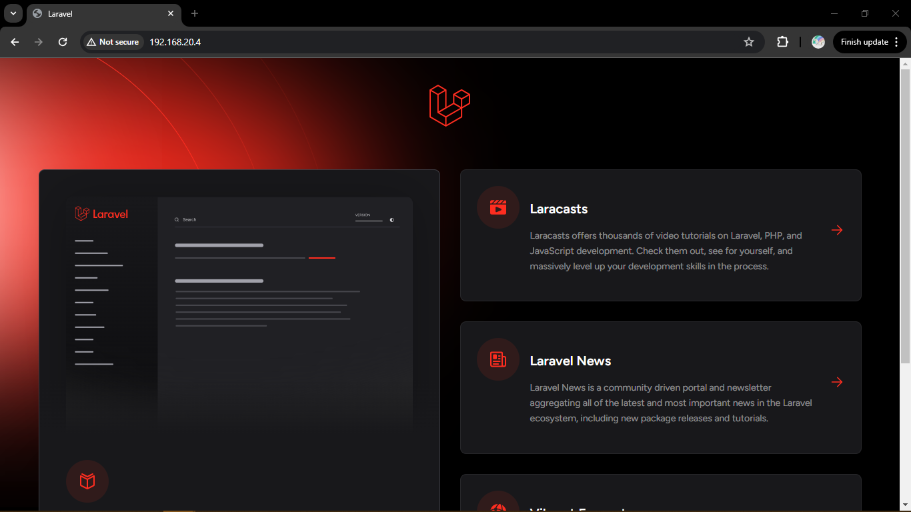
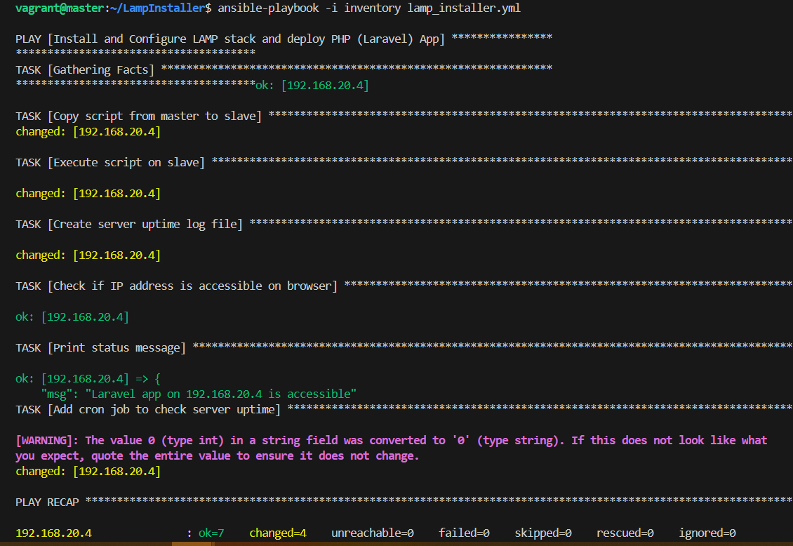
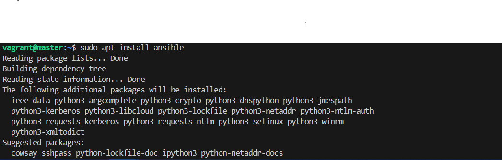
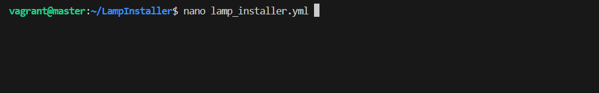
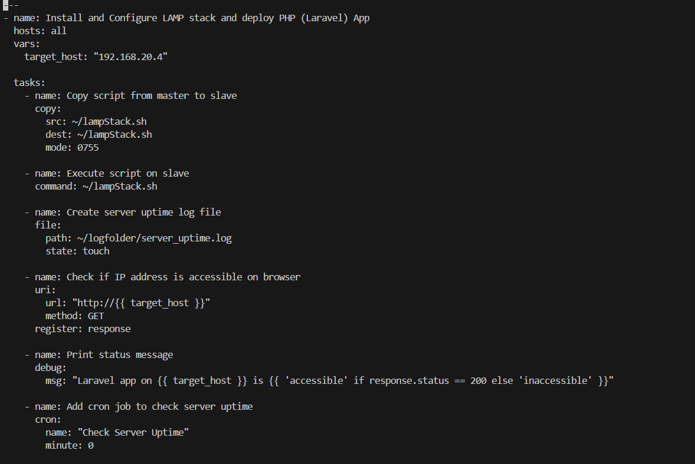
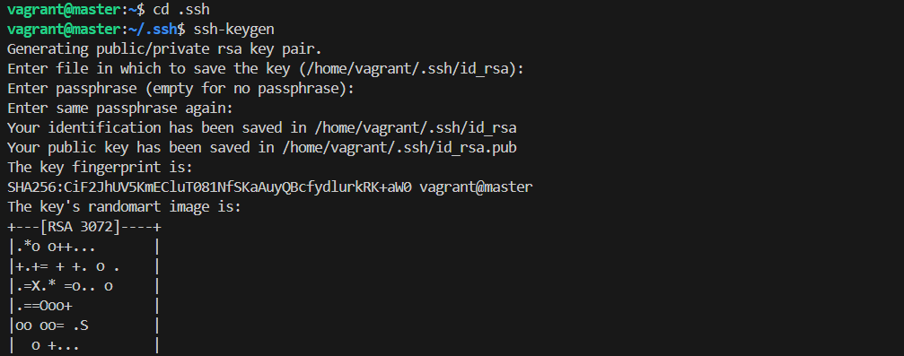
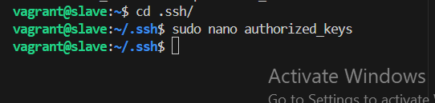
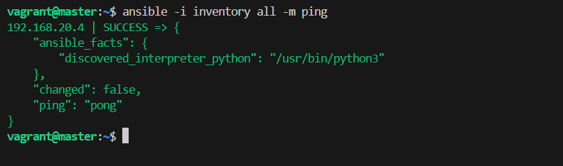
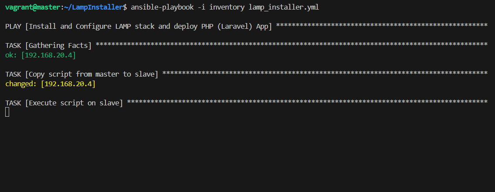

# LAMP Automation

## Introduction

This task is to automate the process of installing and configuring LAMP stack i.e Linux, Apache, MySQL and PHP. Then Deploying a PHP application which is to be accessed via a web browser.

## Table of Contents

1. [Introduction](#introduction)
2. [End Result](#end-result)
3. [The Process](#the-process)

## End Result

#### Accessing the IP address in the browser

#### Playbook execution successful

## The Process

### My approach to getting this done

1.  I created a test environment to do a manual process to get the task done by running the command directly in the terminal.
2.  Each of the commands were then documented to develop a script. See documented commands below

        sudo apt-get update
        echo "update completed"
        sudo apt-get install -y apache2 mysql-server php libapache2-mod-php php-mysql git
        sudo add-apt-repository ppa:ondrej/php
        sudo apt update
        sudo apt install php8.3 php8.3-curl php8.3-dom php8.3-mbstring php8.3-xml php8.3-mysql php8.3-sqlite3 zip unzip -y
        sudo apt-get purge php7.4 php7.4-common -y
        sudo apt-get update
        sudo a2enmod rewrite
        sudo a2enmod php8.3
        sudo service apache2 restart

        sudo mysql -u root
        <!-- Manually configured the SQL using the below command -->
        CREATE USER 'victor'@'localhost' IDENTIFIED BY '12435687';
        GRANT ALL PRIVILEGES ON laraveldb . * TO 'victor'@'localhost';
        CREATE DATABASE laraveldb;
        SHOW DATABASES;
        FLUSH PRIVILEGES;
        EXIT;
        <!-- End of MyQL configuration -->

        cd /usr/bin
        curl -sS https://getcomposer.org/installer | sudo php
        sudo mv composer.phar composer
        composer

        cd /var/www/
        sudo git clone https://github.com/laravel/laravel.git
        cd laravel
        composer install --optimize-autoloader --no-dev
        yes | sudo composer update

        sudo cp .env.example .env
        <!-- manually configured the .env file by inputting the neccesary details created from MySQL config -->
        DB_HOST="localhost"
        DB_DATABASE="laraveldb"
        DB_USERNAME="victor"
        DB_PASSWORD="12435687"
        ENV_FILE="/var/www/laravel/.env"
        <!-- end of .env config -->
        sudo php artisan key:generate
        ps aux | grep "apache" | awk '{print $1}' | grep -v root | head -n 1
        sudo chown -R www-data storage
        sudo chown -R www-data bootstrap/cache
        cd /etc/apache2/sites-available/
        sudo touch laravel.conf
        sudo chown vagrant:vagrant laravel.conf
        chmod +w laravel.conf
        sudo nano laravel.conf
        <!-- added the following to the laravel.conf file -->
        <VirtualHost *:80>
        ServerName victor@localhost
        DocumentRoot /var/www/laravel/public

            <Directory /var/www/laravel/public>
                Options Indexes FollowSymLinks
                AllowOverride All
                Require all granted
            </Directory>

            ErrorLog ${APACHE_LOG_DIR}/laravel-error.log
            CustomLog ${APACHE_LOG_DIR}/laravel-access.log combined

        </VirtualHost>
        <!-- end of laravel.conf file edit -->

        sudo a2dissite 000-default.conf
        sudo a2ensite laravel.conf
        apache2ctl -t
        sudo systemctl restart apache2

        sudo touch /var/www/laravel/database/database.sqlite
        sudo chown www-data:www-data /var/www/laravel/database/database.sqlite
        cd /var/www/laravel/
        sudo php artisan migrate
        sudo php artisan db:seed
        sudo systemctl restart apache2

3.  After the documentation the sections that include editing of files, I learnt about the replacing of texts in files using `sed` (Stream Editor). Created variables for the replacing texts,
    DB_HOST="localhost"
    DB_DATABASE="laraveldb"
    DB_USERNAME="victor"
    DB_PASSWORD="12435687"

                # Alter the .env file
                sed -i "s/DB_HOST=.*/DB_HOST=${DB_HOST}/" ${ENV_FILE}
                sed -i "s/DB_DATABASE=.*/DB_DATABASE=${DB_DATABASE}/" ${ENV_FILE}
                sed -i "s/DB_USERNAME=.*/DB_USERNAME=${DB_USERNAME}/" ${ENV_FILE}
                sed -i "s/DB_PASSWORD=.*/DB_PASSWORD=${DB_PASSWORD}/" ${ENV_FILE}

    and used the Here Document
    `cat <<EOF > file.txt`
    `line 1` <!--- your text goes here --->
    `line 2`
    `EOF`
    to edit the laravel.conf
    sudo cat<<EOF >laravel.conf
    <VirtualHost \*:80>
    ServerName victor@localhost
    DocumentRoot /var/www/laravel/public

                <Directory /var/www/laravel/public>
                    Options Indexes FollowSymLinks
                    AllowOverride All
                    Require all granted
                </Directory>

                ErrorLog ${APACHE_LOG_DIR}/laravel-error.log
                CustomLog ${APACHE_LOG_DIR}/laravel-access.log combined

            </VirtualHost>
            EOF

    and the SQL configuration. The SQL congiuration was stored in a variable and invoked to echo the content of the EOF.

        MYSQL_COMMANDS=$(cat <<EOF
        CREATE USER 'victor'@'localhost' IDENTIFIED BY '12435687';
        GRANT ALL PRIVILEGES ON laraveldb . * TO 'victor'@'localhost';
        CREATE DATABASE laraveldb;
        SHOW DATABASES;
        FLUSH PRIVILEGES;
        EOF
        )
        echo "$MYSQL_COMMANDS" | sudo mysql -u root

4.  After confirming that the script runs, refactoring was made by first sectioning the whole process into Three (3) tasks, and encapsulated them in functions. The function will keep the logs in a file created, to show the status of the code executioning. This is to be able to keep track of the progress, and enhance debugging.

5.  Next, is the installation of Ansible on the Master node, using `apt install ansible -y`
    

6.  Created the inventory file to hold the slave's IP and write a playbook to copy and execute the script.

7.  Also, created the playbook file with `.yml` extension. Wrote the task to execute in the playbook.
    
    

8.  Generated ssh public key for the master and sync the key to the slave authorized_keys.
    
    

9.  Ping the host using the `ansible -i inventory_file all -m ping` command. If the success response is returned, then
    

10. Execute the playbook with `ansible-playbook -i inventory_file playbook.yml`
    
    Playbook success
    
